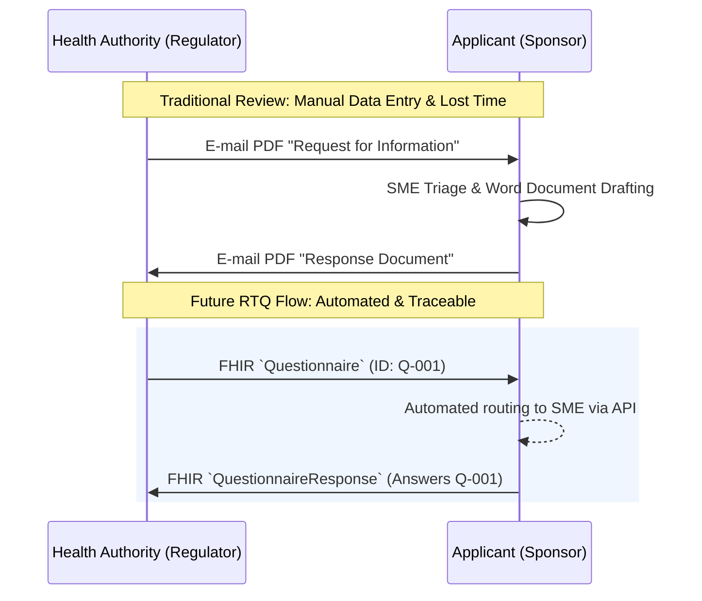

### Introduction

The **Response to Question (RTQ)** Implementation Guide is the standardized framework for the **structured, algorithmic exchange** of regulatory questions and responses. Built on HL7 FHIR R5, it replaces static Word and PDF documents with traceable, machine-readable resources—enabling precise tracking, automated triage, and global harmonization.

*This guide defines the technical framework to create a seamless Q&A loop between Regulators and Applicants.*

  <h3 style="margin-top: 0; color: #166534; font-size: 1.25rem;">✨ See It In Action</h3>
  
Experience the power of structured FHIR data rendered into high-fidelity, interactive dashboards.

  

    <a href="examples/sample-question.html" target="_blank" style="background-color: #22c55e; color: white; padding: 10px 20px; border-radius: 6px; text-decoration: none; font-weight: 600; font-size: 0.95rem;">View Regulator Question</a>
    <a href="examples/sample-response.html" target="_blank" style="background-color: #3b82f6; color: white; padding: 10px 20px; border-radius: 6px; text-decoration: none; font-weight: 600; font-size: 0.95rem;">View Applicant Response</a>
  

### Why Adopt RTQ?

  

    <h4 style="margin-top: 0; color: #2563eb; display: flex; align-items: center; gap: 8px;">📑 Structured & Traceable</h4>
    
Every question is a discrete <code>Questionnaire</code> item; every answer is a linked <code>QuestionnaireResponse</code>. No more lost questions or ambiguous email threads.

  

  

    <h4 style="margin-top: 0; color: #2563eb; display: flex; align-items: center; gap: 8px;">🌍 Harmonized Agencies</h4>
    
One standard format for FDA, EMA, PMDA, and other health authorities. Build your system once to handle questions from any regulator.

  

  

    <h4 style="margin-top: 0; color: #2563eb; display: flex; align-items: center; gap: 8px;">📊 Analytics-Ready</h4>
    
Because questions are structured data, instantly visualize trends: response cycle times, most frequent question topics, and regional variances.

  

  

    <h4 style="margin-top: 0; color: #2563eb; display: flex; align-items: center; gap: 8px;">⚡ Automated Workflow</h4>
    
APIs can route questions to the correct Subject Matter Expert (SME) based on metadata (e.g., "Quality"), reducing triage time from days to minutes.

  

### Background

In biopharmaceutical regulatory affairs, health authorities routinely issue formal questions during the review of marketing authorization applications. Traditionally, these are exchanged as unstructured Word or PDF documents via email or portals. This results in high manual effort, limited traceability, and "dead data" that cannot be analyzed.

RTQ changes that by modeling questions as reusable **Questionnaires** and responses as versioned **QuestionnaireResponses**, aligning regulatory Q&A with the modern digital ecosystem of healthcare.

This aligns with the broader strategy defined in the [APIX Implementation Guide](https://build.fhir.org/ig/HL7/APIX---API-Exchange-for-Medicinal-Products/branches/main/index.html): moving towards the "Real-time algorithmic exchange" envisioned in the 2023 *International Journal of Pharmaceutics* framework [(click to read)](https://www.sciencedirect.com/science/article/pii/S0378517323007627). 

Just as [ISO 20022](https://www.iso20022.org) harmonized global payments, RTQ + APIX harmonizes the regulatory dialogue—standardizing the *content* (RTQ) and the *exchange* (APIX) to unlock sub-second decision making.

<table style="width: 100%; border-collapse: collapse; margin-bottom: 24px;">
  <thead>
    <tr style="background-color: #f1f5f9; border-bottom: 2px solid #cbd5e1;">
      <th style="padding: 12px; text-align: left; width: 50%;">✅ In Scope</th>
      <th style="padding: 12px; text-align: left; width: 50%;">❌ Out of Scope</th>
    </tr>
  </thead>
  <tbody>
    <tr>
      <td style="padding: 12px; border-bottom: 1px solid #e2e8f0; vertical-align: top;">
        <ul style="margin: 0; padding-left: 20px;">
          <li style="margin-bottom: 8px;"><strong>Health Authority Questions:</strong> Profiling of <code>Questionnaire</code> for widely used regulatory templates (Validation issues, Major Objections, Request for Information).</li>
          <li style="margin-bottom: 8px;"><strong>Sponsor Responses:</strong> Profiling of <code>QuestionnaireResponse</code> for applicant replies, supporting evidence attachments, and cross-references.</li>
          <li><strong>Regulatory Metadata:</strong> Standardized extensions for due dates, severity, and review status.</li>
        </ul>
      </td>
      <td style="padding: 12px; border-bottom: 1px solid #e2e8f0; vertical-align: top;">
        <ul style="margin: 0; padding-left: 20px;">
          <li><strong>Transport Mechanisms:</strong> The full submission packaging and transport layer. For instructions on how to package and transport the questionnaire and response, see the <a href="https://build.fhir.org/ig/HL7/APIX---API-Exchange-for-Medicinal-Products/branches/main/index.html">APIX Implementation Guide</a>.</li>
        </ul>
      </td>
    </tr>
  </tbody>
</table>

### Governance & Collaboration

RTQ is developed under the **HL7's Biomedical Research and Regulation (BR&R) Working Group** with active participation from regulators, pharmaceutical companies, and technology vendors.

All meetings are public; notes and recordings are available via [HL7 BR&R Working Group's RTQ project page](https://confluence.hl7.org/spaces/BRR/pages/358267438/Response+to+Health+Authority+Questions+RTQ).

### Get Involved

- Join the weekly calls.
- Test the reference implementation.

We welcome industry, solution providers, and regulators from every region to contribute to this global standard.